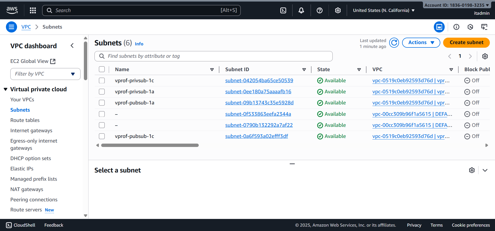
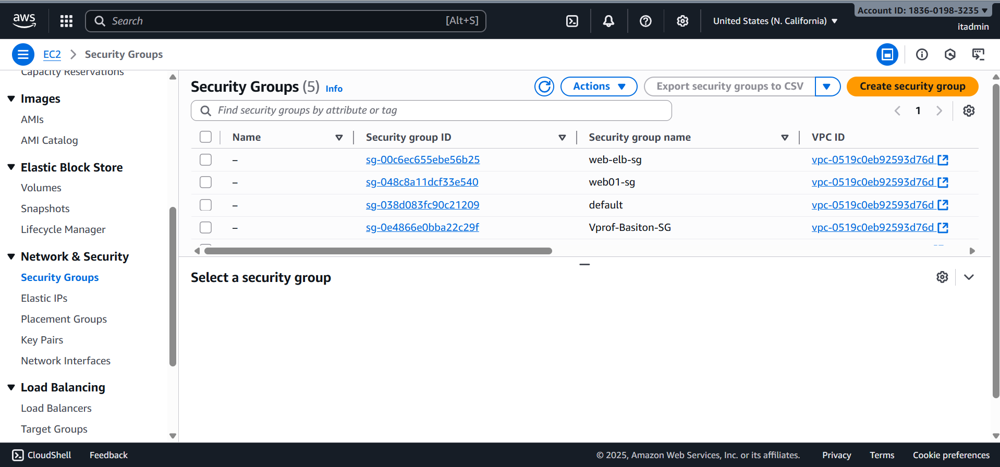
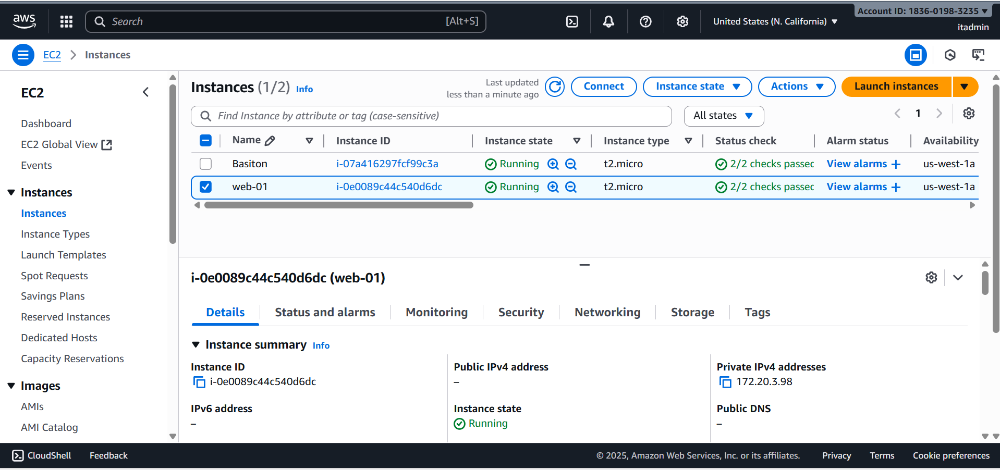
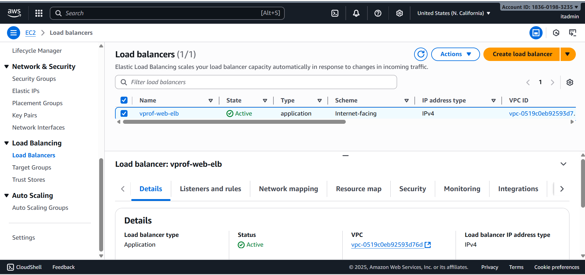
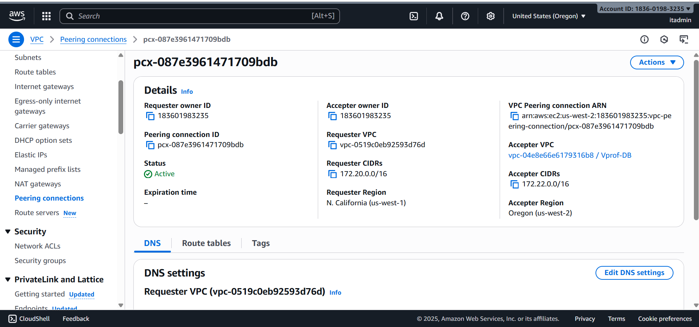

# AWS VPC High Availability Setup

This repository contains a step-by-step guide to setting up a secure and highly available AWS Virtual Private Cloud (VPC) architecture using public and private subnets, NAT Gateway, Bastion Host, Application Load Balancer (ALB), and VPC Peering. The guide includes diagrams, screenshots, and cost optimization tips to help cloud engineers and DevOps enthusiasts practice real-world AWS networking.

---

## 📌 Features

✔ Create VPC with 2 public and 2 private subnets across multiple availability zones  
✔ Configure Internet Gateway and NAT Gateway for routing  
✔ Secure access to private instances using Bastion Host  
✔ Deploy a website inside a private subnet using ALB  
✔ Set up VPC Peering between different regions  
✔ Cost optimization tips for NAT Gateway, Elastic IPs, and tenancy options  
✔ Diagrams and commands for easy learning  

---

## 🛠 Setup Overview

1. Create VPC with CIDR block `172.20.0.0/16`  
2. Launch public and private subnets across availability zones  
3. Configure route tables for IGW and NAT Gateway  
4. Set up Bastion Host with restricted SSH access  
5. Install and deploy a sample website in a private EC2 instance  
6. Create Application Load Balancer to expose the website securely  
7. Set up VPC Peering across regions and update routes  
8. Apply best practices for cost optimization  

---

## 📸 Diagrams

### VPC Architecture  

### VPC Subnets  

### Security Group  

### Instances / Bastion  

### Application Load Balancer (ALB)  

### Website (live screenshot)  

### VPC Peering (primary)  

### VPC Peering (Oregon / cross-region)  

---

## 📂 Folder Structure

aws-vpc-high-availability/
├── README.md  
├── vpc-setup.md  
├── bastion-host.md  
├── website-deployment.md  
├── vpc-peering.md  
├── cost-optimization.md  
└── images/  
    ├── alb.png  
    ├── instance.png  
    ├── sec-grp.png  
    ├── vpc-architecture.png  
    ├── vpc-peering-oregon.png  
    ├── vpc-peering.png  
    ├── vpc-subnet.png  
    └── website-ss-live.png

---

## 💡 Technologies Used

- AWS VPC  
- Internet Gateway & NAT Gateway  
- EC2, Security Groups, Key Pairs  
- Application Load Balancer (ALB)  
- VPC Peering  
- Apache Web Server  

---

## 📜 License

This project is licensed under the MIT License - see the [LICENSE](LICENSE) file for details.

---

## 📬 Contact

Connect with me on [LinkedIn](https://linkedin.com/in/your-profile)  
Check out the full tutorial and diagrams here: [GitHub Repository](https://github.com/ramiz00/aws-vpc-high-availability)

---
Happy Learning! 🚀

