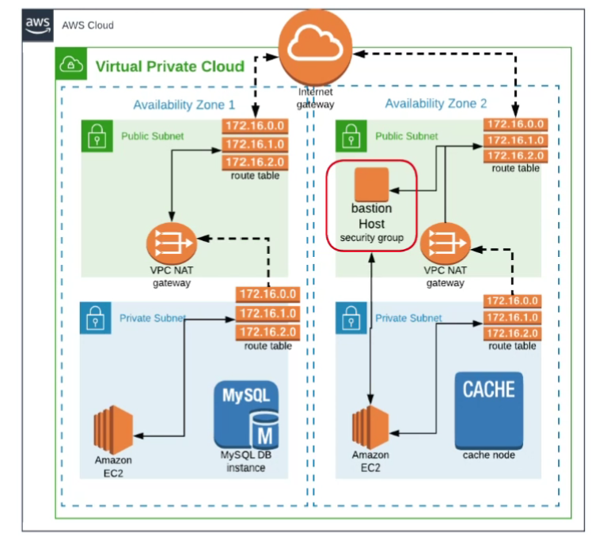

# AWS VPC Setup – Step-by-Step Guide

This guide explains how to create a Virtual Private Cloud (VPC) with public and private subnets, and how to configure routing using Internet and NAT Gateways.

---

## ✅ Step 1 – Create the VPC

1. Go to the AWS Console → VPC → Create VPC.
2. Enter:
   - **Name**: `vprofile-vpc`
   - **IPv4 CIDR block**: `172.20.0.0/16`
3. Click **Create**.

---

## ✅ Step 2 – Create Subnets

Create **4 subnets** across two Availability Zones.

| Subnet Name     | CIDR Block      | Type       | AZ         |
|-----------------|----------------|------------|------------|
| public-sub-1a   | 172.20.1.0/24 | Public     | us-west-1a |
| public-sub-1b   | 172.20.2.0/24 | Public     | us-west-1b |
| private-sub-1a  | 172.20.3.0/24 | Private    | us-west-1a |
| private-sub-1b  | 172.20.4.0/24 | Private    | us-west-1b |

Steps:
- Go to **Subnets → Create subnet** and follow the above information.
- Enable **Auto-assign public IPv4 address** only for Public subnets.

---

## ✅ Step 3 – Create Internet Gateway

1. Go to **Internet Gateways → Create Internet Gateway**.
2. Name it `vprof-igw`.
3. Attach it to `vprofile-vpc`.

---

## ✅ Step 4 – Route Tables

### Public Route Table
1. Create a route table → Name: `vprof-public-rt`.
2. Add route `0.0.0.0/0` pointing to the Internet Gateway.
3. Associate it with **public-sub-1a** and **public-sub-1b**.

### Private Route Table
1. Create a route table → Name: `vprof-private-rt`.
2. Initially leave routes empty. You will update this after creating the NAT Gateway.

---

## ✅ Step 5 – Elastic IP Allocation

1. Go to **Elastic IPs → Allocate new address**.
2. Allocate a static IP → Name: `vprof-nat-eip`.

---

## ✅ Step 6 – Create NAT Gateway

1. Go to **NAT Gateways → Create NAT Gateway**.
2. Select:
   - **Subnet**: `public-sub-1a`
   - **Elastic IP**: `vprof-nat-eip`
3. Click **Create**.

---

## ✅ Step 7 – Update Private Route Table

1. Edit the `vprof-private-rt`.
2. Add route `0.0.0.0/0` pointing to `vprof-nat-gateway`.
3. Associate it with **private-sub-1a** and **private-sub-1b**.

---

## ✅ Step 8 – Enable DNS Hostnames

1. Go to **VPC → Actions → Edit DNS Hostnames**.
2. Enable it for `vprofile-vpc`.

---

### ✅ Notes
- AWS reserves 5 IPs per subnet → usable IPs: 251.
- Reserved: .0 (network), .1 (VPC router), .2 (Amazon DNS), .3 (future use), .255 (broadcast)
- Public subnets can access the internet directly.
- Private subnets access the internet through the NAT Gateway.

---

---

You have now successfully created a highly available VPC network!
